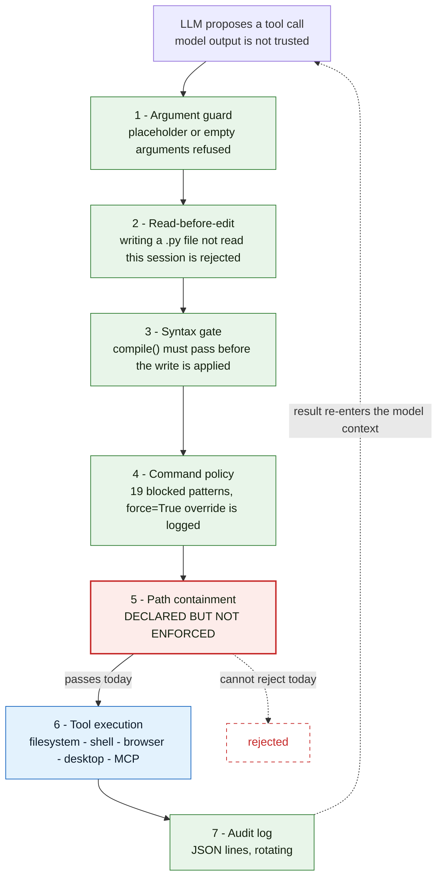
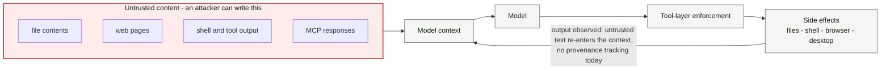

# Security Model

mini_agent executes tools on the machine it runs on: filesystem reads and writes, shell
commands, a headless browser, desktop automation, and MCP servers. This document states what is
enforced, what is only declared, and where the boundaries currently fail.

The central design claim: **controls live in the tool layer, below the model, not in the prompt.**
A prompt instruction is not a security control — the model can be wrong, confused, or steered by
content it reads. Every control below is therefore implemented in Python, in the code path that
executes the tool, and is testable independently of model behavior.

## Enforcement at a glance

Two views. The first is the path every proposed action takes; the second shows where untrusted
content enters and what it can reach.

### 1. Every action passes through the enforcement stack

### 2. Trust boundaries and the injection path

## Trust boundaries

| Component | Trust |
|---|---|
| Operator (human) | Trusted |
| The model (LLM) | **Untrusted** — can be wrong or steered by input |
| Content the agent reads (files, web pages, tool output, MCP responses, UI text) | **Untrusted** |
| The local environment and workspace | Trusted, subject to the controls below |

## What the agent can do

96 registered tools. The security-relevant subset:

| Capability | Examples |
|---|---|
| Filesystem | `read_file`, `write_file`, `edit_file`, `search_files`, `list_directory` |
| Shell | `run_shell` (arbitrary command execution) |
| Network | `web_search`, `fetch_url`, browser automation via Playwright |
| Desktop | `desktop_click`, `desktop_type`, `desktop_launch` (Windows UIA / macOS Atomacos) |
| External servers | `mcp_client` — discovers and calls third-party MCP tool servers over stdio |
| Orchestration | Sub-agent spawning with turn budgets |

## Enforced controls

Each of these is implemented in the tool execution path:

- **Read-before-edit** — a `.py` write is rejected unless that file was read earlier in the
  session. Tracked in `_READ_FILES` (`tools/file_ops.py`).
- **Syntax validation** — Python content is `compile()`d before a write is applied; a syntax
  error aborts the write instead of corrupting the file (`_validate_python_syntax`).
- **Argument validation** — placeholder values (`?`, `...`, empty string, `path`, `file`) are
  refused before reaching the OS (`_BOGUS_PATH_MARKERS`, `_validate_path`).
- **Command policy** — 19 regex patterns are rejected in `run_shell` before execution: recursive
  and forced deletes, in-place edits (`sed -i`), shell redirects that overwrite source files,
  privilege escalation (`sudo`), world-writable chmod, raw disk writes (`dd`, `mkfs`), and
  `git push --force`. Every rejection carries a reason. Overriding requires an explicit
  `force=True` argument, which is logged.
- **Write backups** — previous file content is snapshotted before `edit_file` / `write_file`,
  enabling session undo.
- **Bounded autonomy** — sub-agents run under a turn budget (`max_turns`, default 15), and a
  reservation system (`tools/reservations.py`) prevents two agents from writing the same path
  concurrently.
- **Audit logging** — every tool call is written as JSON lines to
  `~/.mini_agent/logs/agent.log` (rotating), with API errors and tracebacks in separate logs.

## Known gaps

### 1. Workspace isolation is declared but not enforced

`ReadSafetyGate.check()` and `WriteSafetyGate.check()` (`core/safety.py`) currently return
`allowed=True` unconditionally. The containment prefix (`_root_prefix`) is computed in the
constructor and never read. Approximately fifteen call sites branch on `result.allowed` and
return a `BLOCKED` result — those branches cannot fire today. `tests/test_safety.py` pins the
permissive behavior as expected, including `test_path_traversal_allowed` and
`test_read_outside_workspace_allowed`.

This means the README claim of *"all reads/writes bounded to the workspace directory"* is not
accurate for the current commit.

**Why the fix is not a one-liner:** the agent legitimately operates outside the workspace root —
it writes logs to `~/.mini_agent/logs`, creates temp files, probes the environment, and reads
system files. A naive `commonpath` check would break logging and environment detection. The
correct fix is:

1. Deny-by-default containment for **writes**, with an explicit allow-list of known paths.
2. An allow-list for **reads** covering documented paths outside the root.
3. Flipping the `*_allowed` tests in `tests/test_safety.py` to assert blocking, plus a regression
   test that fails if enforcement is removed again.

### 2. No defense against instruction injection from untrusted content

File contents, web pages, browser DOM, MCP server responses, and shell output are returned to the
model verbatim. There is no provenance tracking and no sanitisation, so text the agent reads can
attempt to direct its next tool call. Combined with `run_shell` and desktop automation, a
successful injection has real blast radius.

**Mitigation direction:** mark tool output derived from untrusted sources, refuse tool arguments
whose content traces to an untrusted source when the target is a state-changing operation, and
require human confirmation for state-changing actions whose arguments contain untrusted text.

### 3. Command policy is a denylist

The 19 blocked patterns are a denylist matched against the command string. Denylists are
inherently incomplete: an equivalent effect expressed differently (`find . -delete`,
`python3 -c "import shutil; shutil.rmtree(...)"`, `xargs rm`) is not caught. The more durable
design is an allowlist of permitted command forms, or execution inside a sandbox where the
command policy is a second layer rather than the only one.

## Deployment guidance

If you run this against anything sensitive:

- Run it under a dedicated unprivileged user, or in a container.
- Point the workspace at a dedicated directory; assume the agent can reach anything that user
  can reach.
- Treat `force=True` overrides as a reviewed event — grep the audit log for them.
- Do not give it network egress and untrusted input at the same time.

## Reporting

Security issues: **bqtruong@uno.edu**. Please include the commit hash and a reproduction.
